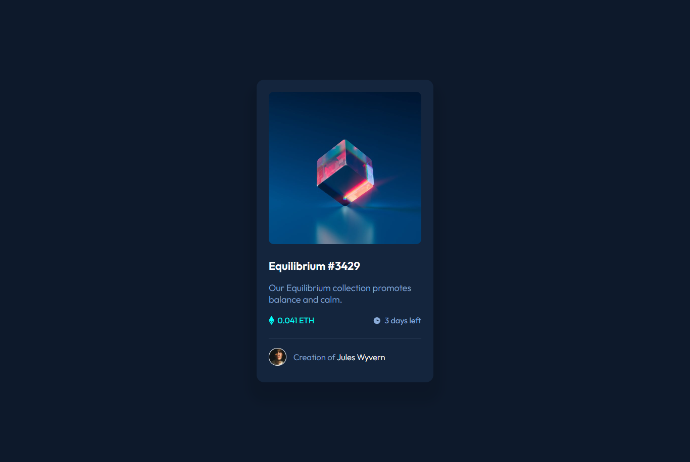

# Frontend Mentor - NFT preview card component solution

This is a solution to the [NFT preview card component challenge on Frontend Mentor](https://www.frontendmentor.io/challenges/nft-preview-card-component-SbdUL_w0U). Frontend Mentor challenges help you improve your coding skills by building realistic projects. 

## Table of contents

- [Overview](#overview)
  - [The challenge](#the-challenge)
  - [Screenshot](#screenshot)
  - [Links](#links)
- [My process](#my-process)
  - [Built with](#built-with)
  - [What I learned](#what-i-learned)
- [Author](#author)

## Overview

### The challenge

Users should be able to:

- View the optimal layout depending on their device's screen size
- See hover states for interactive elements

### Screenshot



### Links

- Solution URL: [Github - NFT Card](https://github.com/MYSTYX7/nft-card-component)
- Live Site URL: [Netlify - NFT Card](https://determined-meitner-b35431.netlify.app/)

## My process

### Built with

- Semantic HTML5 markup
- CSS custom properties

### What I learned

Working with overlays and links with hover properties.


```css
#name:hover{
    color: hsl(178, 100%, 50%);
  }

.overlay{
    position: absolute;
    background: hsl(178, 100%, 50%, 0.5);
    border-radius: 10px;
    left: 24px;
    right: 24px;
    top: 24px;
    bottom: 5px;
    opacity: 0;
    transition: all .5s ease;
  }
```
## Author

- Frontend Mentor - [@MYSTYX7](https://www.frontendmentor.io/profile/MYSTYX7)
- Twitter - [@cric_mystyx](https://www.twitter.com/cric_mystyx)